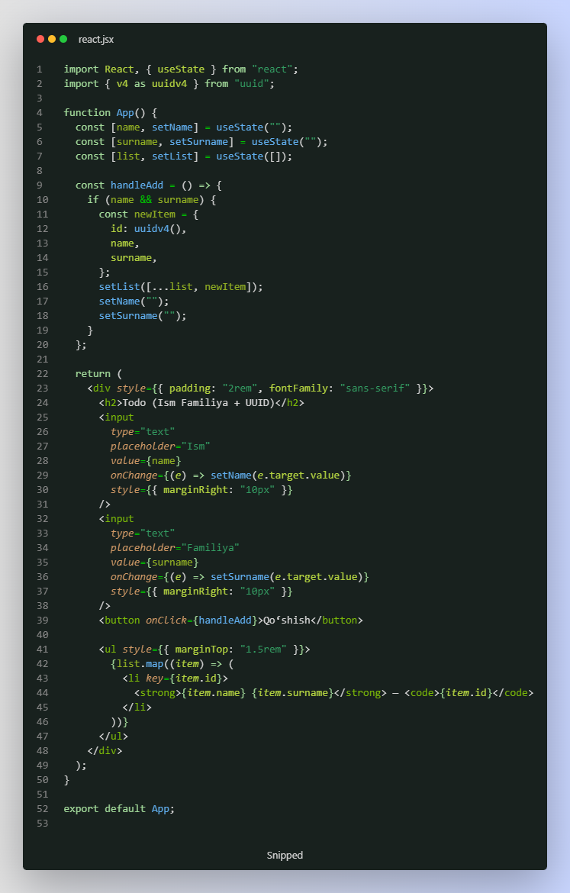

#  UUID - unical(takrorlanmas) "ID" lar yaratish uchun library


## 🆔UUID nima va nega ishlatiladi ?
 ***UUID (Universally Unique Identifier) — bu butun dunyo bo‘ylab takrorlanmaydigan noyob ID raqam yaratish uchun ishlatiladi.
 Masalan:  550e8400-e29b-41d4-a716-446655440000 - shunday ko'rinishda takrorlanmas iD lar yaratib beradi***

### Nima maqsadda ishlatiladi ? 

- React: Har bir komponent yoki list elementga key berishda
- Database: Global ID yaratishda (masalan, user_id)
- REST API: URL’larda xavfsiz ID sifatida
- Offline dasturlar: Internet bo‘lmasa ham ID generatsiya qilish uchun

## O'rnatish :
- npm install uuid

## Foydalanish :
```
import { v4 } from 'uuid';

let id = v4()        // v4() - funksiyasi har safar chaqirilganidan bizga yangi unical bo'lgan id qaytaradi.

console.log(id)

//codni 1-martta ishlatganimda shunday id yaratdi : 4a44c1af-14eb-4a03-98da-047ba082f6df
// 2- martta ishlatganimda esa :                    abef39b1-833a-4b2f-ac0b-138cf220509e
```



